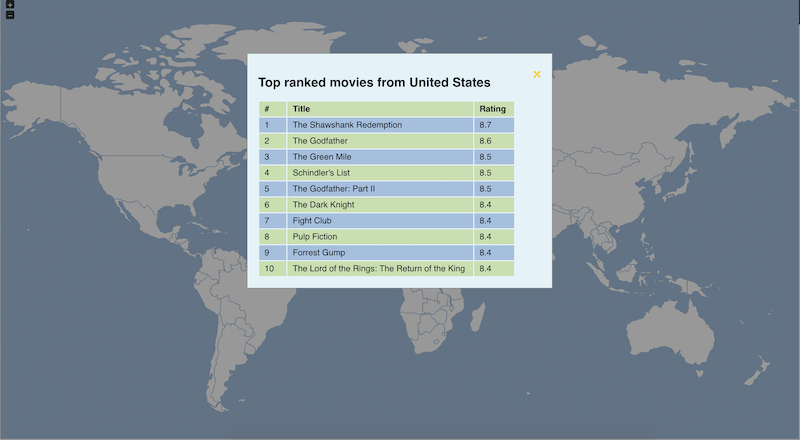
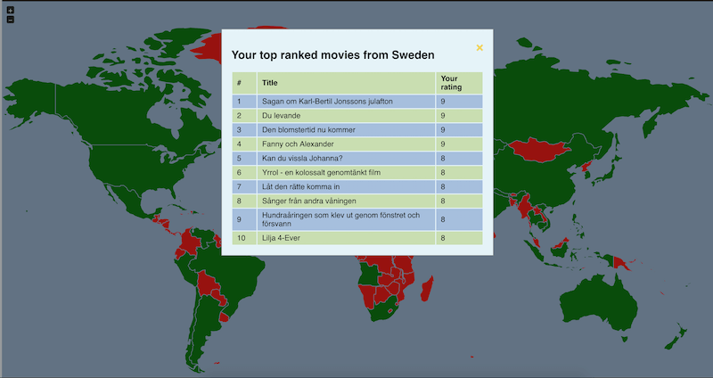
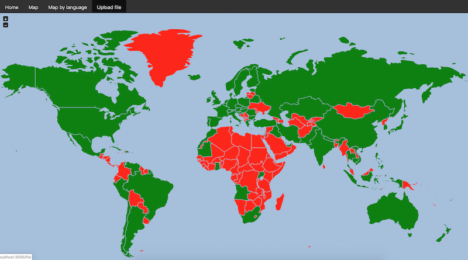

# World in Movies


This webapp project is for showing which parts of the world that you've seen movies from.
Countries that you've seen a movie from, appears as green.
And countries that you haven't seen yet appears as red.

In future might add functionality to add different graphs


As IMDB no longer exposes the data on their FTP servers, and have removed the country of origin  
data from their new API. I'll try and make a new start of this project from scratch.

I've decided against using java, as it's too resource consuming for the basic servers that I will use.


## TODO

* Traefik
* Travis
* Create new image, showing overall architecture

## Performance Metrics

Check why backend takes so much memory.
  - Seems to be related to gunicorn spawning multiple processes.
    When setting gunicorn workers to 1, mem usage goes down to 40MB
    But haven't actually loadtested anything yet, this is only when just started, as is.

```docker stats worldinmovies_webapp_1 worldinmovies_backend_1 worldinmovies_db_1 ```

| CONTAINER ID |           NAME          |  CPU % |    MEM USAGE / LIMIT   |   MEM % |      NET I/O   | BLOCK I/O       | PIDS |
|:------------:|:-----------------------:|:------:|:----------------------:|:-------:|:--------------:|:---------------:|:----:|
| faa56a493bf0 | worldinmovies_webapp_1  |  0.00% | 18.16MiB / 3.732GiB    |  0.48%  | 2.69MB / 654kB | 34.9MB / 0B     | 11   |
| 56cee9abd0ea | worldinmovies_backend_1 |  0.03% | 279.8MiB / 3.732GiB    |  7.32%  | 2.63MB / 494kB | 19.3MB / 0B     | 10   |
| 764ee594592b | worldinmovies_db_1      |  0.00% | 27.04MiB / 3.732GiB    |  0.71%  | 2.71MB / 221kB | 5.89GB / 8.37GB | 16   |

## To start
Dependencies:

* Docker https://docs.docker.com/engine/installation/
* Docker-compose https://docs.docker.com/compose/install/

```bash
docker-compose pull
docker-compose up --build
docker-compose kill #To stop the running services
docker-compose down #To stop and cleanup after running services
```

## Examples
#### Top ranked from USA

#### My top ranked from country

#### How it looks after uploading imdb ratings


